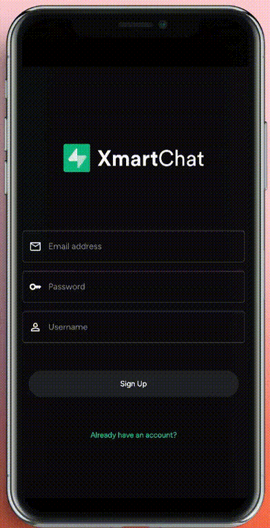

**Serverless Messaging App Demo for Supabase Workshop.**
*Exploring the Serverless World: An Introduction with Supabase.*

## Workshop Details:

Welcome to Xmartchat, a dynamic messaging application developed with [Flutter](https://flutter.dev/) and powered by [Supabase](https://supabase.com), designed specifically as a demonstration for our Supabase workshop.
This app serves as an exemplar of the potential of serverless architecture, showcasing how serverless technologies, particularly Supabase, can revolutionize the way we build real-time communication applications.

<table align="center" style="width: 40%; text-align: center;"> 
    <th>
        
    </th>
</table>

## Purpose
Xmartchat acts as a hands-on, interactive showcase during our workshop, highlighting the power and flexibility of serverless computing.
Through this demo app, participants will:
- **Learn Serverless Principles:** Understand the fundamental concepts behind serverless architecture and its advantages in modern app development.
- **Explore Supabase Features:** Discover how Supabase simplifies database management, authentication, and real-time data synchronization.
- **Experience Real-Time Communication:** Interact with Xmartchat's real-time messaging capabilities to witness serverless technology in action.
- **Inspire Innovation:** Use Xmartchat as a foundation for experimenting with serverless concepts, encouraging innovative thinking and development.

## Workshop requirements

To effectively engage with the Xmartchat demo app and our Supabase workshop, please ensure you have the following:
- **Flutter Installation:** Make sure you have Flutter installed on your system. If not, you can follow the official Flutter installation guide: [Flutter Installation Guide](https://flutter.dev/docs/get-started/install)
- **Dart & Flutter Knowledge:** Familiarity with Dart programming language and Flutter framework is essential. If you are new to Dart and Flutter, consider going through the official documentation and tutorials to strengthen your skills.
- **Integrated Development Environment (IDE):** You'll need an IDE for Flutter development. We recommend using either Visual Studio Code (VS Code) or Android Studio. Choose the one you are most comfortable with and ensure it's properly set up for Flutter development.

## Repo Structure

- ['mobile'](./mobile/): This folder contains all the Flutter code for the mobile application, including the user interface and frontend functionality.

- ['backend'](./backend/): In this directory, you'll discover the edge functions developed using Supabase, which power the backend operations of the Xmartchat application.

- ['solution'](./solution/): Within this folder, you'll find the solution of the workshop!

## Join the Xmartlabs Community!
At Xmartlabs we love to share our knowledge through our open source work. Feel free to check out our [GitHub profile](https://github.com/xmartlabs) and contribute in any way you see fit. You can also explore our [blog](https://blog.xmartlabs.com/), where we regularly post new insights and discoveries. See you there!

<th>
    
</th>
